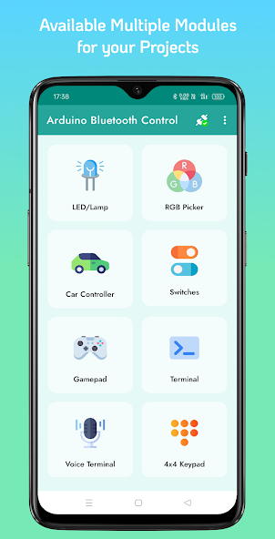
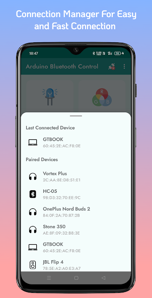
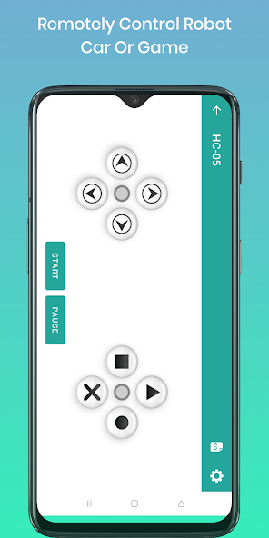
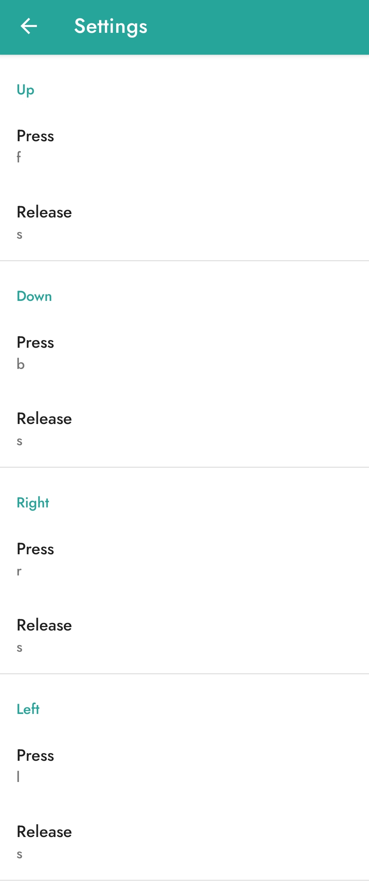

# 🕷️ Quadruped Bluetooth-Controlled Robot

## 📌 Overview
An Arduino-based 4-legged (quadruped) robot designed for smooth walking and remote operation via Bluetooth. This project features 8 servo motors controlling the hips and knees, allowing the robot to execute complex movements and navigation commands sent from a mobile application.

## 🤝 Acknowledgments & Continuity
This project is a continuation of the work developed by our colleagues. We have built upon their foundation to enhance the robot's capabilities and transition to Bluetooth-based control.
* **Original Project Repository:** [Otto-Quad-Robot](https://github.com/A-m-ira/Otto-Quad-Robot-)

## 🚀 Features
* **Bluetooth Control:** Seamless remote operation using HC-05/HC-06 modules and a customized mobile interface.
* **Smooth Kinematics:** Advanced interpolation functions (`smoothMove`, `smoothMovePair`, `smoothMoveQuad`) ensure fluid, organic motions.
* **Modular Gaits:** Pre-calibrated movement patterns for walking forward, backward, turning, and standing.
* **Isolated Power System:** Dedicated power routing to handle high-current servo demands without affecting logic stability.

## 🛠️ Hardware Components
* 1x Arduino (Nano)
* 8x Servo Motors (SG90)
* 1x Bluetooth Module (HC-05)
* 1x Sensor Shield / Expansion Board
* 1x XL4015 Buck Converter (Current/Voltage Regulated)
* 18650 Li-ion Batteries (High Discharge)

## 🔌 Pin Configuration

| Component | Arduino Pin |
| :--- | :--- |
| Leg 1 Hip | D7 |
| Leg 1 Knee | D11 |
| Leg 2 Hip | D5 |
| Leg 2 Knee | D8 |
| Leg 3 Hip | D9 |
| Leg 3 Knee | D4 |
| Leg 4 Hip | D10 |
| Leg 4 Knee | D6 |
| Bluetooth RX | D1 (TX) |
| Bluetooth TX | D0 (RX) |

## ⚠️ Crucial Power Supply Warning
Powering 8 servos from the Arduino's 5V pin is strictly prohibited as it causes system brownouts and erratic behavior.

**Recommended Setup:**
* **Servos:** Powered via XL4015 Buck Converter set to **5V**.
* **Arduino & Bluetooth:** Powered via the **VIN** pin (7.4V - 9V) to utilize the internal linear regulator for clean logic power.
* **Common Ground:** Ensure the `GND` of the battery, Buck Converter, and Arduino are all interconnected.

## 📱 Mobile App Setup & Configuration

### 1. Pairing
* Enable Bluetooth on your phone.
* Pair with the module named **HC-05**.
* Use the pairing PIN: `1234`.
* **Note:** For a stable connection, keep the phone within **50 cm** of the robot.

### 2. App Installation
Download and install the **Bluetooth Arduino Control** app from the Play Store:
* [Download Link](https://play.google.com/store/apps/details?id=com.giristudio.hc05.bluetooth.arduino.control)

### 3. Connection & Mapping
1. Open the app and click the **Connect** icon (top-left).
2. Select **HC-05** from the paired devices list.
   
3. Choose the **GamePad** mode.
   
4. Go to **Settings** (top-right icon) and map the buttons using **small letters** as follows:
   * **UP:** `f`
   * **DOWN:** `b`
   * **LEFT:** `l`
   * **RIGHT:** `r`
   * Set the **Release** option for all four directions to: `s`
   

## 👥 Team Members
1. **Mohamed Ahmed El-Sayed El-Haddad**
2. **Ahmed Abdel-Aty Ibrahim**
3. **Ahmed Gomaa**
4. **Ibrahim El-Tamamy**
5. **Mohamed Mansour**
6. **Mohamed Ekramy**
7. **Amr Wael**
8. **Mahmoud Badr**
9. **Khaled Walid**
10. **Mohamed Khairy**
11. **Talaat Mostafa**
12. **Mohamed Abdel-Baqi**
13. **Amira Gamal**
14. **Hanan Abdelrahman**
15. **Hanan Mujahed**

## 🎓 Under the Supervision of
* **Prof. Dr. Tamer Medhat** (Dean of the Faculty)
* **Dr. Marwa El-Seddik**
* **Eng. Abdel-Raouf Hawash**

## 💻 Installation & Usage
1. Assemble the quadruped chassis.
2. Connect servos and the Bluetooth module as per the Pin Configuration table.
3. Upload the control code to the Arduino (ensure Bluetooth RX/TX are disconnected during upload).
4. Connect your mobile app to the HC-05/HC-06 module.
5. Deploy and control!
